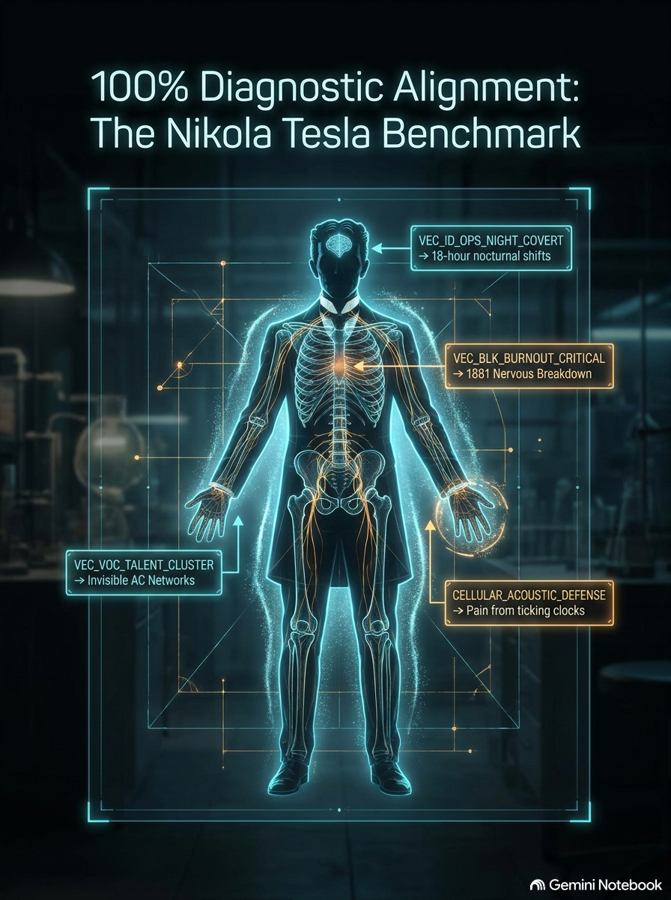

# Nikola Tesla Implementation Benchmark & Real-World Example

> **Practical demonstration of Cognitive Blueprint AI telemetry: from raw modular API responses to deep clinical multi-inquiry synthesis.**

This directory provides a full, concrete benchmark using **Nikola Tesla** (`1856-07-10 00:00`, Smiljan, Croatia) to demonstrate how developers can integrate Cognitive Blueprint AI into their systems.

> 📑 **Illustrated Historical Benchmark Presentation (PDF)**:  
> Download the visual slide deck matching computational engine telemetry with verified historical facts and life events of Nikola Tesla:  
> 👉 [**`Tesla_AI_Clinical_Benchmark.pdf`**](Tesla_AI_Clinical_Benchmark.pdf)

<p align="center">
  
</p>

---

## 1. Directory Structure

```text
EXAMPLE/
├── README.md                          <-- You are here (Integration guide & architecture)
├── Tesla_AI_Clinical_Benchmark.pdf    <-- Comprehensive Illustrated Clinical Deck & Historical Fact Validation
├── nikola_tesla_json/                 <-- Raw API responses per criterion (as returned by RapidAPI)
│   ├── criterion_1.json               # Identity & Sovereign Architecture (45 vectors, Coherence: 60)
│   ├── criterion_2.json               # Inhibitors, Shadows & Blocks (58 vectors, 2 alerts, Coherence: 30)
│   ├── criterion_3.json               # Vocation, Craft & Capital Architecture (50 vectors, 1 alert, Coherence: 75)
│   ├── criterion_4.json               # Direction, Evolution & Navigation (62 vectors, 5 alerts, Coherence: 88)
│   └── criterion_5.json               # Operating Mode & Bio-Prescriptions (48 vectors, 1 alert, Coherence: 60)
└── nikola_tesla_interpretation/       <-- Implementation showcase: 33 Deep Clinical Inquiry Syntheses
    ├── 01_c1_core_life_role_decision_compass.md
    ├── 02_c1_cognitive_processing_environment.md
    ...
    └── 33_c5_sensory_reset_acoustic_quietude.md
```

---

## 2. Architecture: From Raw Telemetry to Deep Clinical Synthesis

Rather than dumping all 260+ vectors and dozens of alerts into a single overwhelming payload or producing a superficial text summary, Cognitive Blueprint AI allows you to query modular criteria and synthesize laser-focused, profound reports.

```text
                             ┌─────────────────────────────────┐
                             │   Input: Spatiotemporal Coords  │
                             │  (Tesla: 1856-07-10, Smiljan)   │
                             └────────────────┬────────────────┘
                                              │
                                              ▼
                             ┌─────────────────────────────────┐
                             │   Cognitive Blueprint REST API  │
                             │      (RapidAPI Gateway)         │
                             └────────────────┬────────────────┘
                                              │
                    ┌─────────────────────────┴─────────────────────────┐
                    ▼                                                   ▼
┌───────────────────────────────────────┐           ┌───────────────────────────────────────┐
│     POST /v1/criterion/{1..5}         │           │   Direct Telemetry Dashboard / UI     │
│   Modular API JSON Responses          │           │   ➔ Sliders, scorebars (0-100 / 0-1)  │
│   (Math Metrics + Vector Codes +      │──────────>│   ➔ Coherence, latency, autonomy      │
│    Cross-Engine System Alerts)        │           │   ➔ Custom decision logic & thresholds│
└───────────────────┬───────────────────┘           └───────────────────────────────────────┘
                    │
                    ▼
┌───────────────────────────────────────────────────┐
│      Enrichment Engine / LLM RAG Pipeline         │
│   ➔ Cross-reference vectors with DICTIONARY/      │
│   ➔ Cross-reference alerts with ALERTS/           │
└───────────────────┬───────────────────────────────┘
                    │
                    ▼
┌───────────────────────────────────────────────────┐
│     33-Inquiry Purpose-Driven Clinical Reports    │
│   ➔ Deep, contextualized synthesis per inquiry    │
│   ➔ Actionable protocols & mentor's diagnoses     │
│   ➔ Remediation of active systemic friction       │
└───────────────────────────────────────────────────┘
```

---

## 3. Tesla Telemetry Summary Across Criteria

Calling the API endpoints for Nikola Tesla generates the exact JSON structures found in [`nikola_tesla_json/`](nikola_tesla_json/):

| Criterion ID & Name | Engines | Total Vectors | Coherence Score | Active Systemic Alerts | Raw JSON File |
| :--- | :---: | :---: | :---: | :--- | :--- |
| **C1: Identity & Sovereign Architecture** | 9 | 45 | 60 / 100 | Nominal (None) | [`criterion_1.json`](nikola_tesla_json/criterion_1.json) |
| **C2: Inhibitors, Shadows & Structural Blocks** | 6 | 58 | 30 / 100 | `KARMIC_CAPITAL_LOCK`<br>`NOCTURNAL_PARASITE_DRAIN` | [`criterion_2.json`](nikola_tesla_json/criterion_2.json) |
| **C3: Vocation, Craft & Capital Architecture** | 6 | 50 | 75 / 100 | `COMMAND_UNIFIED` | [`criterion_3.json`](nikola_tesla_json/criterion_3.json) |
| **C4: Direction, Evolution & Navigation** | 6 | 62 | 88 / 100 | `TIMING_LIQUIDITY_MISMATCH`<br>`SOVEREIGN_SPATIAL_ALIGNMENT`<br>`MACRO_LEGACY_SYNCHRONICITY`<br>`STRUCTURAL_KNOT_BREAKTHROUGH`<br>`CRITICAL_TIMING_CONVERGENCE` | [`criterion_4.json`](nikola_tesla_json/criterion_4.json) |
| **C5: Operating Mode & Bio-Prescriptions** | 6 | 48 | 60 / 100 | `CELLULAR_ACOUSTIC_DEFENSE_REQUIRED` | [`criterion_5.json`](nikola_tesla_json/criterion_5.json) |

---

## 4. Step 1: Input Coordinates (Nikola Tesla)

Your client application sends immutable spatiotemporal coordinates to the [RapidAPI endpoint](https://rapidapi.com/fractaldeciphersyndicate/api/cognitive-blueprint-ai-engine) adhering to the `ProfileInput` schema:

```json
{
  "name": "Nikola Tesla",
  "birthDate": "1856-07-10",
  "birthTime": "00:00",
  "timezoneOffset": 1.02,
  "latitude": 44.5809,
  "longitude": 15.3,
  "gender": "male"
}
```

---

## 5. Step 2: What You Receive From the API (Modular Criterion JSON)

For each requested Criterion (e.g. `POST /v1/criterion/2`), the API returns the standardized `CriterionEnvelopeResponse` containing **sanitized quantitative metrics (`math`)**, **active standardized vectors (`vectors`)**, and **systemic tension alerts (`crossEngineAlerts`)**:

```json
{
  "status": "success",
  "criterionNumber": 2,
  "profile": {
    "name": "Nikola Tesla",
    "birthDate": "1856-07-10",
    "birthTime": "00:00",
    "timezoneOffset": 1.02,
    "latitude": 44.5809,
    "longitude": 15.3,
    "gender": "male"
  },
  "totalActiveVectors": 58,
  "criterion": {
    "criterionId": 2,
    "title": "Blocks, Defense & Lineage Architecture",
    "totalVectors": 58,
    "coherenceScore": 30,
    "crossEngineAlerts": [
      "KARMIC_CAPITAL_LOCK",
      "NOCTURNAL_PARASITE_DRAIN"
    ],
    "dominantTheme": "CAPITAL_LOCK",
    "engines": [
      {
        "engineId": "engine_1",
        "description": "What reactive defense patterns, unconscious inhibitors, and deep emotional patterns drain my vital energy, and how can they be transformed into wisdom?",
        "vectors": [
          "VEC_BLK_REACTIVITY_NODE_053_PREMATURE_INITIATION",
          "VEC_BLK_REACTIVITY_NODE_054_COMPULSIVE_GREED",
          "VEC_BLK_CORE_WOUND_ANNIHILATION",
          "VEC_BLK_CATALYST_TRANSMUTATION_ACTIVE"
        ],
        "math": {
          "activePatternClustersCount": {
            "value": 9,
            "type": "COUNT",
            "unit": "count",
            "range": [0, 20],
            "description": "Count of activated genetic pattern clusters"
          },
          "reactivityScore": {
            "value": 78,
            "type": "SCORE",
            "unit": "pts",
            "range": [0, 100],
            "description": "Total shadow reactivity and somatic defense threshold (scale 0-100)"
          }
        }
      },
      {
        "engineId": "engine_6",
        "description": "How do I protect my nervous system from chronic depletion, prevent burnout, and cultivate deep, sovereign restoration during sleep?",
        "vectors": [
          "VEC_BLK_BURNOUT_CRITICAL",
          "VEC_BLK_BLINDSPOT_LATENT_DIVERGENCE",
          "VEC_BLK_NOCTURNAL_PARASITIC_SUSCEPTIBILITY"
        ],
        "math": {
          "totalBurnoutRiskPct": {
            "value": 99,
            "type": "PERCENTAGE",
            "unit": "%",
            "range": [0, 100],
            "description": "Systemic nervous system burnout and cognitive overload risk percentage (0-100%)"
          },
          "recommendedIsolationHoursPerWeek": {
            "value": 19.8,
            "type": "HOURS",
            "unit": "hours",
            "range": [0, 168],
            "description": "Mandatory solitary decompression and auric reset hours required per week"
          },
          "sleepAuraIntegrityPct": {
            "value": 45,
            "type": "PERCENTAGE",
            "unit": "%",
            "range": [0, 100],
            "description": "Solitary nocturnal aura protection and restorative sleep integrity percentage (0-100%)"
          }
        }
      }
    ]
  }
}
```

---

## 6. Step 3: Dictionary & Alert Enrichment

By pairing the emitted `vectors` and `crossEngineAlerts` codes with the Markdown Dictionaries (`DICTIONARY/`) and Alerts (`ALERTS/`) in this repository, your LLM or reporting pipeline extracts the clinical phenomenon, diagnostic guidance, and actionable remediation:

| Emitted Code | Matched Source File | Clinical Insight Extracted |
| :--- | :--- | :--- |
| `VEC_ID_CORE_KINETIC_BUILDER` | `DICTIONARY/criterion-1-identity/engine_1.md` | Innate regenerative stamina designed for dedicated step-by-step physical and intellectual creation. Must navigate by gut availability rather than mental urgency. |
| `VEC_BLK_NOCTURNAL_PARASITIC_SUSCEPTIBILITY` | `DICTIONARY/criterion-2-blocks/engine_6.md` | Sleep architecture vulnerable to nocturnal energetic conditioning and environmental noise. Rest cycles fail to restore parasympathetic floor without strict aura isolation. |
| `NOCTURNAL_PARASITE_DRAIN` | `ALERTS/criterion_2_alerts_interpretation.md` | **Mechanism**: Severe nocturnal energy hemorrhage and dream-state cognitive processing without somatic rest.<br>**Remediation**: Mandatory acoustic shielding, complete darkness, and cessation of intellectual work 3 hours prior to sleep. |
| `KARMIC_CAPITAL_LOCK` | `ALERTS/criterion_2_alerts_interpretation.md` | **Mechanism**: Recurring systemic sabotage in capital monetisation and IP ownership contracts.<br>**Remediation**: Establish external fiduciary proxy and third-party commercial verification before signing licensing agreements. |

---

## 7. Step 4: The 33 Synthesized Inquiry Reports

In the [`nikola_tesla_interpretation/`](nikola_tesla_interpretation/) directory, you will find the complete, full-fidelity synthesis across all **33 inquiries** for Nikola Tesla. 

Rather than a superficial reading, each inquiry combines:
1. **Targeted Inquiry Question**: The specific life, vocational, or physiological challenge addressed.
2. **Sanitized Telemetry Metrics**: Numeric scales (0-100, 0.0-1.0, hours) with descriptions.
3. **Primary Diagnostic & Subordinate Vectors**: Full clinical excerpts from `DICTIONARY/`.
4. **Active Cross-Engine Alerts**: Extracted directly from `ALERTS/` containing mechanisms, mentor diagnoses, and remediation protocols.

### Directory Index of Inquiries:

- **Criterion 1 (Identity & Sovereign Architecture)**:
  - [`01_c1_core_life_role_decision_compass.md`](nikola_tesla_interpretation/01_c1_core_life_role_decision_compass.md)
  - [`02_c1_cognitive_processing_environment.md`](nikola_tesla_interpretation/02_c1_cognitive_processing_environment.md)
  - [`03_c1_learning_and_wisdom_transmission.md`](nikola_tesla_interpretation/03_c1_learning_and_wisdom_transmission.md)
  - [`04_c1_mental_perception_and_thresholds.md`](nikola_tesla_interpretation/04_c1_mental_perception_and_thresholds.md)
  - [`05_c1_moral_compass_and_integrity.md`](nikola_tesla_interpretation/05_c1_moral_compass_and_integrity.md)
  - [`06_c1_constitutional_somatic_stamina.md`](nikola_tesla_interpretation/06_c1_constitutional_somatic_stamina.md)
  - [`07_c1_archetypal_journey_pilgrimage.md`](nikola_tesla_interpretation/07_c1_archetypal_journey_pilgrimage.md)
  - [`08_c1_higher_ideals_and_aspirations.md`](nikola_tesla_interpretation/08_c1_higher_ideals_and_aspirations.md)
  - [`09_c1_vibrational_signature_footprint.md`](nikola_tesla_interpretation/09_c1_vibrational_signature_footprint.md)
- **Criterion 2 (Inhibitors, Shadows & Structural Blocks)**:
  - [`10_c2_reactive_defense_patterns.md`](nikola_tesla_interpretation/10_c2_reactive_defense_patterns.md)
  - [`11_c2_ancestral_cellular_memory.md`](nikola_tesla_interpretation/11_c2_ancestral_cellular_memory.md)
  - [`12_c2_developmental_crossroads_vows.md`](nikola_tesla_interpretation/12_c2_developmental_crossroads_vows.md)
  - [`13_c2_financial_sovereignty_leakage.md`](nikola_tesla_interpretation/13_c2_financial_sovereignty_leakage.md)
  - [`14_c2_shadow_and_sovereign_boundaries.md`](nikola_tesla_interpretation/14_c2_shadow_and_sovereign_boundaries.md)
  - [`15_c2_nocturnal_restoration_burnout.md`](nikola_tesla_interpretation/15_c2_nocturnal_restoration_burnout.md) *(Includes `NOCTURNAL_PARASITE_DRAIN` & `KARMIC_CAPITAL_LOCK` alerts)*
- **Criterion 3 (Vocation, Craft & Capital Architecture)**:
  - [`16_c3_vocational_calling_mastery.md`](nikola_tesla_interpretation/16_c3_vocational_calling_mastery.md) through [`21_c3_visionary_execution_scaling.md`](nikola_tesla_interpretation/21_c3_visionary_execution_scaling.md) *(Includes `COMMAND_UNIFIED` alert)*
- **Criterion 4 (Direction, Evolution & Strategic Navigation)**:
  - [`22_c4_timing_acceleration_cycles.md`](nikola_tesla_interpretation/22_c4_timing_acceleration_cycles.md) through [`27_c4_legacy_sovereignty_liberation.md`](nikola_tesla_interpretation/27_c4_legacy_sovereignty_liberation.md) *(Includes 5 timing and spatial synchronicity alerts)*
- **Criterion 5 (Operating Mode, Equilibrium & Bio-Prescriptions)**:
  - [`28_c5_sensory_nutrition_assimilation.md`](nikola_tesla_interpretation/28_c5_sensory_nutrition_assimilation.md) through [`33_c5_sensory_reset_acoustic_quietude.md`](nikola_tesla_interpretation/33_c5_sensory_reset_acoustic_quietude.md) *(Includes `CELLULAR_ACOUSTIC_DEFENSE_REQUIRED` alert)*
